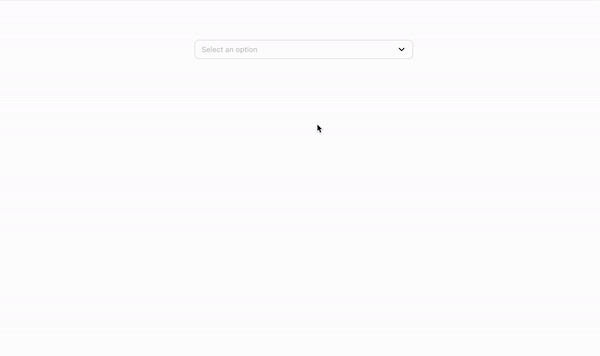

# Custom Drop-Down

The custom dropdown is a web-based application that allows users to create and customize their own dropdown menus. The application is built using Angular, HTML, SCSS, and Typescript.

The custom dropdown is perfect for web developers who want to add an extra layer of customization to their websites.

# Demo



# Technical choice

- Angular
- Unit Test
- storybook

---

This document describes the high-level architecture of Custom DropDown

## Code Map

---

This section talks about various important directories and data
structures.

```
root/
  |
  +-src/
      |
      +-app/
        |
        +-shared/
            |
            +-components/            // Shared Angular components
            +-interface/             // Contains interface
        +-app.component.ts       // Entry point
        +-features               // contains different features the app will feature
            |
            +-components/            // Shared Angular components
            +-interface/             // Contains interface
      |
      +-assets/                // Media content (images, icons, fonts, etc.)

```

### `src/`

This directory contains the source code of the application itself.

### `src/assets`

Contains media content, such as images, vector icons, fonts, etc. grouped
by directory:
`src/images`, `src/fonts`, `src/icons`...

### `src/

### `src/app/features/components/`

Here we store all reusable self-written components and wrappers for
third-party components, so we can use third-party components without being
bound to a specific implementation.

Also it's important to separate all reusable logic from specific component,
and store it in a related section of the `src/utils/` directory.

The component should have the following structure:

```
{ComponentName}/
    {ComponentName}.component.html		             contains component template
    {ComponentName}.component.ts		             contains component definition
    ({ComponentName}.component.spec.ts)?             contains component tests (optional)
    ({ComponentName}.component.scss)?                contains component styles (optional)
    ({ModuleName}).module.ts                         contains module definition
    ({fileName}.ts)*		                         additional files with component-specific
								                       logic (optional)
    {interface}/
         {interfaceName.ts}              contains component interface
    {storybook}/
         {componentName.stories.ts}                 contains storybook on the component
    {styles}/
         {ComponentName.scss}                       contains component style

    {models}/
         {ComponentName.model.ts}                   contains components enum
```

`src/app/features/components/` directory also has the `index.ts` file with all component exports.

### `src/app/features/`

Here features folder contains all the feature the project will have. This way we can manage different project features.
{FeatureName}

This project was generated with [Angular CLI](https://github.com/angular/angular-cli) version 15.2.5.

## Development server

Run `ng serve` for a dev server. Navigate to `http://localhost:4200/`. The application will automatically reload if you change any of the source files.

## Code scaffolding

Run `ng generate component component-name` to generate a new component. You can also use `ng generate directive|pipe|service|class|guard|interface|enum|module`.

## Build

Run `ng build` to build the project. The build artifacts will be stored in the `dist/` directory.

## Running unit tests

Run `ng test` to execute the unit tests via [Karma](https://karma-runner.github.io).

## Running end-to-end tests

Run `ng e2e` to execute the end-to-end tests via a platform of your choice. To use this command, you need to first add a package that implements end-to-end testing capabilities.

### `npm run storybook`

Launches the storybook.

[deployment](http://localhost:6006/).
